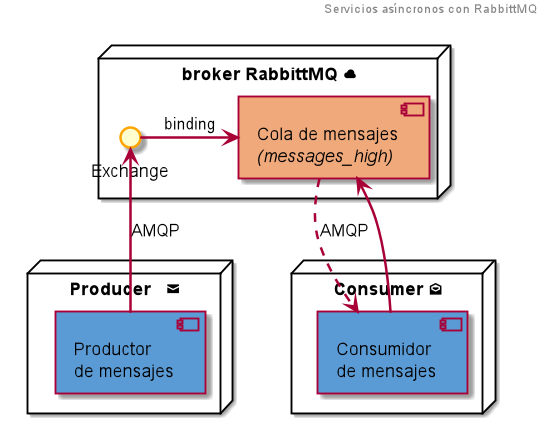
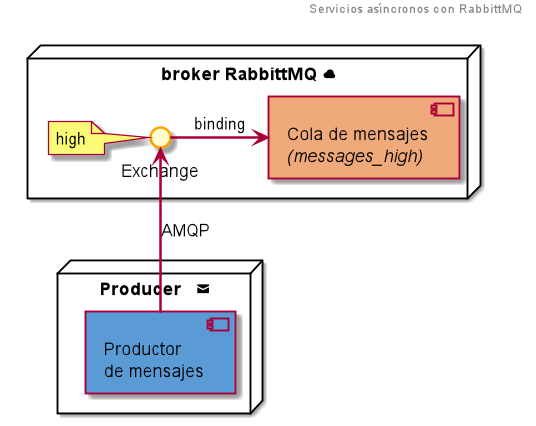

 AOS - Ejemplo de servicios asíncronos
======================================

[](http://opensource.org/licenses/MIT)
[](http://php.net/)
> Ejemplo de servicio asíncrono basado en mensajes _(con el gestor RabbitMQ)_

En este ejemplo se implementa un servicio asíncrono que se apoya en un gestor de colas de mensajes.
El gestor de mensajes (_message broker_) empleado en este ejemplo es [RabbitMQ][rabbitmq].
El servicio utiliza el protocolo [AMQP][amqp] para conectarse con el gestor de mensajes y proporciona
una interfaz que permite realizar dos sencillas operaciones:
- Enviar una notificación a la cola
- Consumir una notificación de la cola

En el ejemplo, cada notificación (en formato JSON) contiene un texto y una lista de direcciones de
correo electrónico similar a:
```json
{
  "textMessage": "Message text",
  "users": [
    "foo@example.com",
    "bar@example.com"
  ]
}
```
&nbsp;


### Operación enviar notificación _(productor)_
La operación de envío de notificaciones actúa como **productor**: construye un mensaje que contiene la
notificación y lo entrega al intermediario, es decir, lo envía a la cola de mensajes. El mensaje permanecerá
en la cola en espera de ser consumido por algún servicio.



En este ejemplo la cola se ha denominado `messages_high`. 

### Operación consumir notificación _(consumidor)_
La operación _consumir notificación_ actúa como **consumidor**: se conecta al gestor de mensajes, 
y, si hay algún mensaje, lo recoge. En este ejemplo, cuando se procesa un mensaje se simula el
envío de un texto a la lista de destinatarios de la notificación.


Para simplificar el ejemplo, tanto productor como consumidor residen en el
mismo servicio, pero perfectamente podrían ser servicios completamente independientes.

***
## Despliegue de los servicios

Para acceder a estas operaciones se ha desarrollado una API que ha sido documentada
empleando el esquema [OpenAPI 3.0][openapi]. Esta especificación se ha elaborado empleando el editor
[Swagger][swagger]. Adicionalmente se incluye la interfaz de usuario ([Swagger-UI][swagger-ui])
de esta fenomenal herramienta que permite realizar pruebas interactivas de manera completa y elegante.

Para desplegar el proyecto empleando Docker, basta con ejecutar los siguientes comandos 
desde el directorio raíz del proyecto:

```bash
$> docker-compose up -d
$> docker exec -u dev -it aos_php bash
:/home/wwwroot$> cd ./aos
:/home/wwwroot/aos$> composer install
```

La ejecución de estos tres últimos comandos sólo es necesaria la primera vez que se realiza el despliegue.

Una vez desplegado el proyecto, se podrá acceder a la interfaz de usuario de la especificación 
a través de [http://localhost:80/api-docs/index.html][lh]. Además, también se podrá acceder a la herramienta
RabbitMQ Management en [http://localhost:15672/][rmq]. Por otra parte, para acceder a los
detalles internos de la aplicación se puede acceder a la dirección [http://localhost/_profiler][profiler].

### Accediendo a la cola

La cola de mensajes es creada cuando se recibe un mensaje por primera vez. Para acceder al
estado de las diferentes colas en el _broker_ se puede acceder a la dirección
[http://localhost:15672/#/queues](http://localhost:15672/#/queues). Si se ha enviado algún
mensaje aparecerá la cola (llamada `messages_high`), y se pueden examinar todos los
detalles de la misma en tiempo real (la interfaz se actualiza por defecto cada 5 segundos).

Aparte de utilizar la interfaz de la api, también es posible consumir los mensajes a través
de la consola de comandos (con mayor nivel de detalle). Para ello se deberán ejecutar los
siguientes comandos:
```bash
$> docker exec -it -u dev aos_php bash
:/home/wwwroot$> cd ./aos
:/home/wwwroot/aos$> bin/console -vvv --limit=1 messenger:consume
```

### Deteniendo los servicios

Finalmente, para detener la ejecución de los servicios se ejecutará el comando:
```
$> docker-compose stop
```

[lh]: http://localhost:80/api-docs/index.html
[openapi]: https://www.openapis.org/
[profiler]: http://localhost/_profiler
[swagger]: http://swagger.io/
[swagger-ui]: https://github.com/swagger-api/swagger-ui
[amqp]: https://www.amqp.org/
[rabbitmq]: https://www.rabbitmq.com/
[rmq]: http://localhost:15672/#/