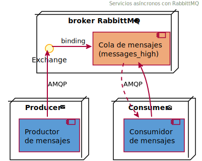
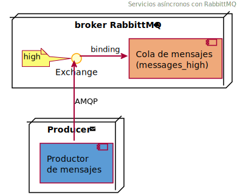

 AOS: Ejemplo de servicios asíncronos
======================================

[](http://php.net/)
[](http://opensource.org/licenses/MIT)
> 📬 Ejemplo de servicio asíncrono basado en mensajes _(con el gestor RabbitMQ)_

En este ejemplo se implementan dos servicios asíncronos que se comunican a través de un gestor de colas de mensajes.
El gestor de mensajes (_message broker_) empleado es [RabbitMQ][rabbitmq], que proporciona un sistema de negociación
de mensajes de código abierto. Por su parte, los servicios utilizan el protocolo [AMQP][amqp] para conectarse con 
el gestor de mensajes, y además ofrecen una interfaz para poder realizar dos sencillas operaciones:
- Enviar una notificación a la cola
- Consumir una notificación de la cola

En el ejemplo, cada notificación (en formato JSON) contiene un texto y una lista de direcciones de
correo electrónico similar a:
```json
{
  "textMessage": "Message text",
  "users": [
    "foo@example.com",
    "bar@example.com"
  ]
}
```
&nbsp;


### 📨 Servicio de envío de notificaciones _(productor, puerto 8000)_
El servicio de envío de notificaciones actúa como **productor**: construye un mensaje que contiene la
notificación y lo entrega al intermediario, es decir, lo envía a la cola de mensajes. El mensaje permanecerá
en la cola a la espera de ser consumido por algún servicio.



En el ejemplo la cola se ha denominado `messages_high`. Dentro de RabbittMQ, cuando un productor desea
encolar un nuevo mensaje, lo que hace es enviarlo a un intercambiador (_exchange_), que se
comporta como agente de enrutamiento. Este intercambiador (`high` en el ejemplo) es el responsable
del envío de los mensajes a las diferentes colas de acuerdo a sus reglas internas. 

### 📩 Servicio consumidor de notificaciones _(consumidor, puerto 8080)_
El servicio _consumir notificación_ actúa como **consumidor**: se conecta al gestor de mensajes, 
y, si hay algún mensaje en la cola, lo recoge. En este ejemplo, cuando se procesa un mensaje 
simplemente se simula el envío de un texto a la lista de destinatarios de la notificación.


En esta implementación, tanto productor como consumidor utilizan un cuarto servicio
(denominado _php_fpm_) que proporciona el intérprete FPM (FastCGI Process Manager) de PHP.

***
## 🆙 Despliegue de los servicios

Para acceder a estas operaciones se ha desarrollado una API que ha sido documentada
a través del esquema [OpenAPI 3.0][openapi]. Esta especificación se ha elaborado empleando el editor
[Swagger][swagger]. Adicionalmente se incluye la interfaz de usuario ([Swagger-UI][swagger-ui])
de esta fenomenal herramienta que permite realizar pruebas interactivas de manera completa y elegante.

Para desplegar el proyecto empleando Docker, basta con ejecutar el siguiente comando 
desde el directorio raíz del proyecto:

```docker
docker compose up -d
```

La primera vez que se generan las imágenes pueden ser algo lenta, debido a la instalación de los
diferentes componentes requeridos por la aplicación.

Desde la consola del sistema anfitrión se puede ver la lista de los contenedores desplegados empleando:
```docker
docker ps --format "{{.Names}}: Ports [{{.Ports}}]"
``` 

Una vez desplegado el proyecto, se podrá acceder a la interfaz de usuario de la especificación 
a través de [http://localhost:8000/api-docs/index.html][lh]. Además, también se podrá acceder a la herramienta
RabbitMQ Management en [http://localhost:15672/][rmq] (usuario _guest_ y password _guest_).

### 📈 Accediendo a la cola

La cola de mensajes se crea en el instante en el que se recibe el primer mensaje. El
estado de las diferentes colas en el _broker_ se puede observar a través de la dirección
[http://localhost:15672/#/queues](http://localhost:15672/#/queues). Si se ha enviado algún
mensaje aparecerá una cola (denominada `messages_high`), y se pueden examinar todos los
detalles de la misma en tiempo real (la interfaz se actualiza automáticamente por defecto cada 5 segundos).

Aparte de utilizar la interfaz de la API, también es posible consumir los mensajes a través
de la consola de comandos (con mayor nivel de detalle). Para ello se deberán ejecutar los
siguientes comandos:
```docker
docker exec -it -u dev php_fpm bash
```
```bash
cd ./aos
bin/console -vvv --limit=1 messenger:consume
```

### 🛑 Deteniendo los servicios

Como curiosidad, si se desea acceder a los detalles internos del funcionamiento de la aplicación
(implementada sobre el framework PHP [Symfony][sf]) se puede acceder a la dirección
[http://localhost:8000/_profiler][profiler].

Finalmente, para detener la ejecución de los contenedores desde el anfitrión se ejecutará el comando:
```docker
docker compose down --rmi local -v
```

[lh]: http://localhost:8000/api-docs/index.html
[openapi]: https://www.openapis.org/
[profiler]: http://localhost:8000/_profiler
[swagger]: http://swagger.io/
[swagger-ui]: https://github.com/swagger-api/swagger-ui
[amqp]: https://www.amqp.org/
[rabbitmq]: https://www.rabbitmq.com/
[rmq]: http://localhost:15672/#/
[sf]: https://symfony.com/